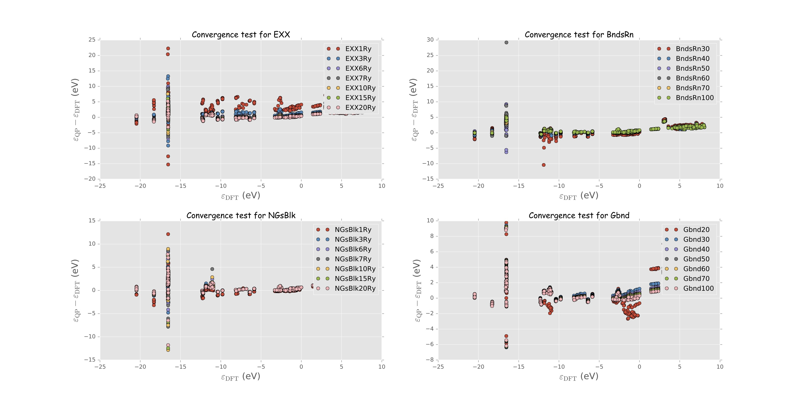

# dft-tools-mods
Convenient tools and useful home-brewed modifications for DFT software

## qe-plotter

A handy Python plotting script for Quantum Espresso (QE).

It reads the band-structure data file generated by QE and plots the data with matplotlib. Currently, it supports both electron and phonon bands.

Usage:

```python
from qeplotter import plot 
point_names = ['$\Gamma$','X','U','L','$\Gamma$','K','X','W']
Q = [0,20,30,40,65,85,95,105]
ef = 7.4953
plot(infile="some_electron_bands.txt",Q=Q,point_names=point_names,efermi=ef)
```

Or

```python
from qeplotter import plot 
point_names = ['$\Gamma$','X','U','L','$\Gamma$','K','X','W']
Q = [0,20,30,40,65,85,95,105]
plot(infile="some_phonon_bands.txt",Q=Q,phonon=True,point_names=point_names,phdos="phonon_dos.txt")
```

## ab-plotter
A handy Python script to plot electron band-structures from ABINIT.
The input file has a post-fix like `_DS_EIG` and `_DS1_EIG` if you enable ABINIT to dump its eigen-energies.

An example can be:

```python
import numpy as np
from abplotter import plot,ha2ev,plot_pdos
a = np.array([[.5,.5,.0],[.5,.0,.5],[.0,.5,.5]]) # lattice vectors
Q = np.cumsum([0,40,20,20,40,40,20,20]) # positions of the special points
point_names = ['$\Gamma$', 'X', 'U', 'L', '$\Gamma$', 'K', 'X', 'W']
ef = -3.94158

# #if you want only the band without/with total DOS, you can use the line below
# plot(a,"abinit.abo_DS2_EIG",Q,point_names,ef=ef,ymin=-4,ymax=7)# ,fildos="abinit.abo_DS3_DOS"

# #if you want PDOS in a big figure, use the next two lines
# atoms = ['Cs','Cs','Sn'] + 6*['Br']
# plot_pdos('abinit.abo_DS3_',atoms,xmin=-4,xmax=8,ymax=20)

# #if you want bands with PDOS, use the following lines
atoms = ['Cs','Cs','Sn'] + 6*['Br']
plot(a,"abinit.abo_DS2_EIG",Q,point_names,ymin=-4,ymax=7,ef=ef,
    pdos_pref='abinit.abo_DS3_',atoms=atoms,pdos_max=15)
```

## qe-ph-pdos-mod

The modifications in this part enable QE to seamlessly compute the partial/projected density of states for phonons. In the output file of a DOS calculation, one will find the total and the partial DOS (decomposed to each atom in the system).

I would suggest backup the original files before recompiling the software with this patch.

The following two files need to be replaced.

```
$YOUR_DIR_TO_QE/PHonon/PH/matdyn.f90
```

and

```
$YOUR_DIR_TO_QE/flib/dost.f90
```

After replacing these two files, you can `cd $YOUR_DIR_TO_QE/PHonon/PH` and `make` to update QE.

## yambo-tools

Yambo is an excited state code that finds the quasi-particle energy levels using GW methods. Its convergence testing is very tedious and complex. Therefore, an automation tool and a visualisation function is provided to ease the burden of researchers.

`ppa_conv.py`: one needs to set some parameters for the test, most of which have the same name as those in the yambo documentation.

`plot_conv.py`: plot function.

An example plot is shown below where the convergence of each parameters can be determined.

